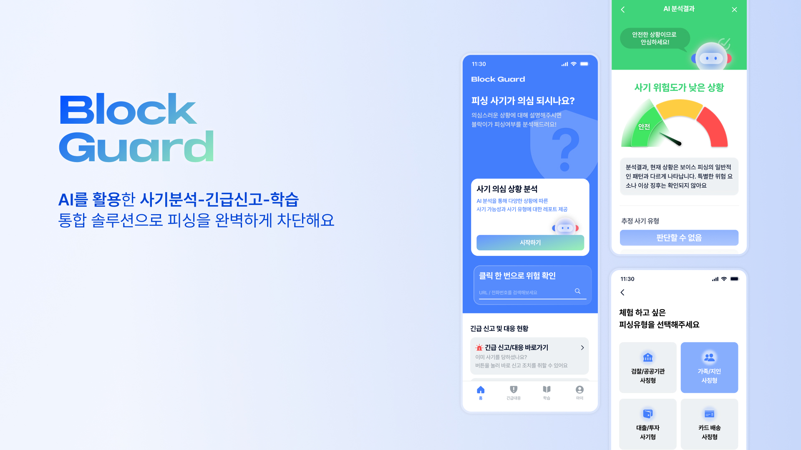
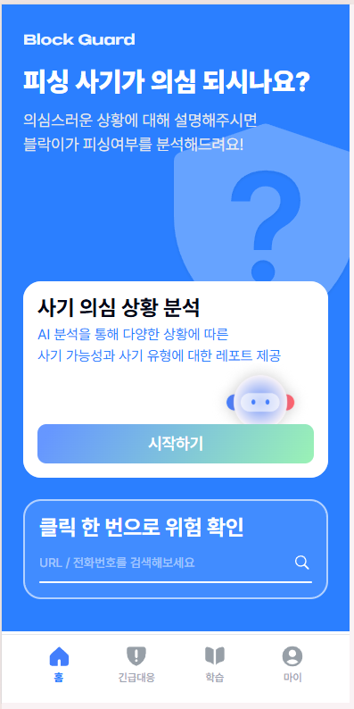
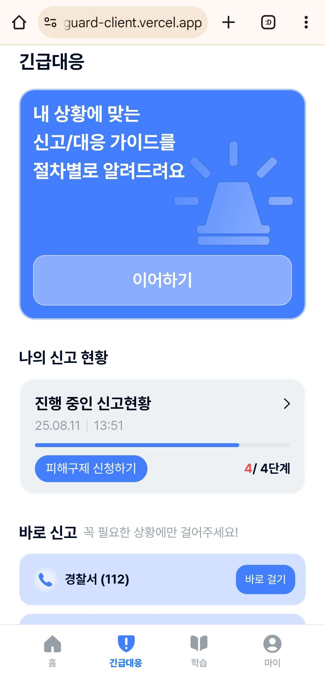
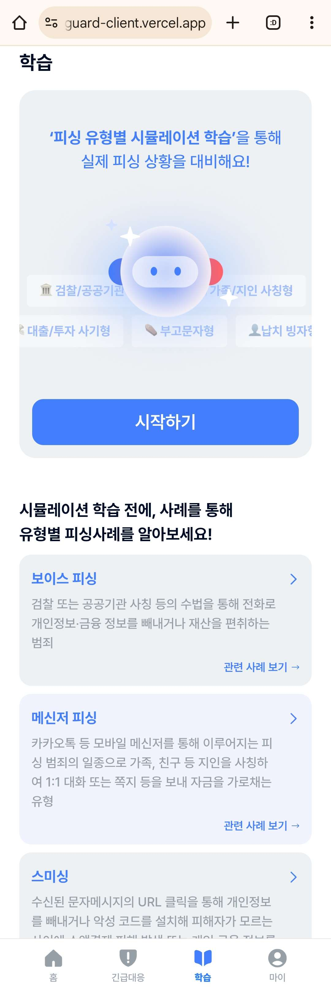
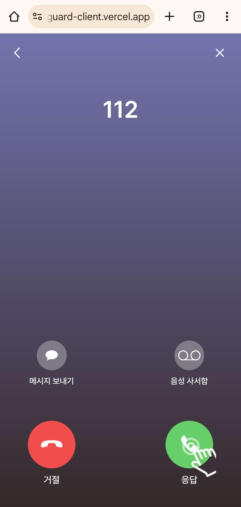
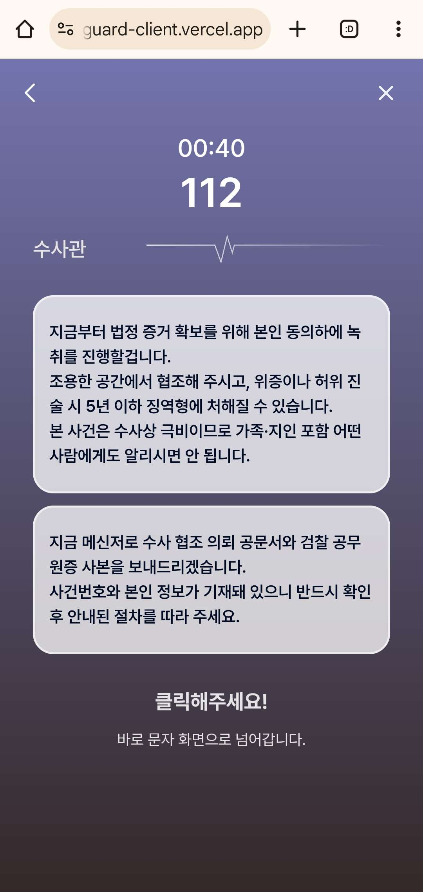
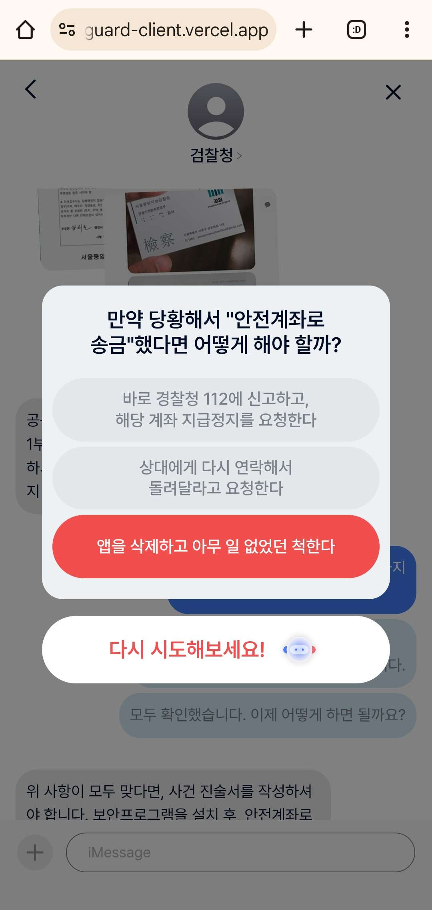
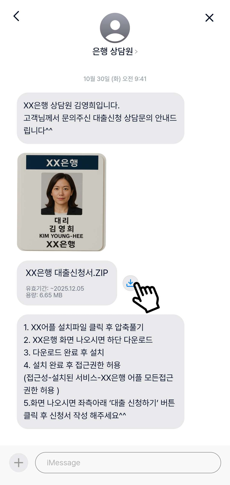

# BlockGuard: 보이스피싱, 예방, 대응, 학습을 제공하는 웹 서비스



## 🌟 프로젝트 소개

시뮬레이션을 통한 예방, 의심 상황에 대한 AI 분석, 피해 후 대응 가이드를 제공하는 BlockGuard 프로젝트 - 프론트엔드 레포지토리.

## 🚀 배포 링크

🔗 **https://block-guard-client.vercel.app/**

## 🖼️ 주요 화면 및 기능 미리보기

- 사기 분석 흐름 :

<table width="100%">
  <tr>
    <td width="50%" align="center">
      
      <br>
      <sub><b>[사기 분석 시연]</b></sub>
    </td>
    <td width="50%" align="center">
      
      <br>
      <sub><b>[카드 배송 사칭형 시뮬레이션 시연]</b></sub>
    </td>
  </tr>
</table>

<table width="100%">
  <tr>
    <td width="33%" align="center">
      
      <br>
      <sub><b>[메인 페이지]</b></sub>
    </td>
    <td width="33%" align="center">
      
      <br>
      <sub><b>[긴급 대응 홈 페이지]</b></sub>
    </td>
    <td width="33%" align="center">
      
      <br>
      <sub><b>[시뮬레이션 홈 페이지]</b></sub>
    </td>
  </tr>
</table>

<table width="100%">
  <tr>
    <td width="25%" align="center">
      
      <br>
      <sub><b>[전화 화면 시뮬레이션]</b></sub>
    </td>
    <td width="25%" align="center">
      
      <br>
      <sub><b>[보이스 시뮬레이션]</b></sub>
    </td>
    <td width="25%" align="center">
      
      <br>
      <sub><b>[시뮬레이션 퀴즈]</b></sub>
    </td>
    <td width="25%" align="center">
      
      <br>
      <sub><b>[문자 시뮬레이션]</b></sub>
    </td>
  </tr>
</table>

## ⚙️ 기술 스택

- **Main**: `React, TypeScript, Vite, Tailwind CSS`
- **Deployment**: `Vercel`
- **Etc.**: `Lodash, TanstackQuery(React Query), Axios, Shadcn UI`

## 📁 폴더 구조

```
📁 src
 ┣ 📁 apis           // API 요청 관련 함수들을 관리합니다.
 ┣ 📁 assets         // 이미지, 아이콘 등 정적 파일들을 보관합니다.
 ┣ 📁 components     // 재사용 가능한 공통 UI 컴포넌트 (Button, Header 등)를 관리합니다.
 ┣ 📁 hooks          // 여러 컴포넌트에서 공통으로 사용하는 Custom Hook을 관리합니다.
 ┣ 📁 layouts        // 일부 페이지 컴포넌트들을 감싸는 공통 레이아웃을 정의합니다.
 ┣ 📁 pages          // 라우팅의 단위가 되는 페이지 컴포넌트들을 관리합니다.
 ┣ 📁 routes         // 라우팅 설정을 관리합니다.
 ┣ 📁 types          // 프로젝트 전반에서 사용되는 TypeScript 타입을 정의합니다.
 ┣ 📁 utils          // 특정 도메인에 종속되지 않는 순수 함수 및 유틸리티 함수를 관리합니다.
 ┣ 📄 main.tsx       // 애플리케이션의 진입점(Entry Point)입니다.
 ┗ 📄 App.tsx        // 애플리케이션의 최상위 컴포넌트입니다.
```

<details>
<summary>
    <strong>전체 파일 구조 보기(클릭하여 펼치기)</strong>
</summary>

```
📁 src
│
├── 📁 apis
│   ├── 📄 auth.ts
│   ├── 📄 axiosInstance.ts
│   ├── 📄 emergency.ts
│   ├── 📄 fraud.ts
│   ├── 📄 guardians.ts
│   ├── 📄 home.ts
│   ├── 📄 mypage.ts
│   └── 📄 news.ts
│
├── 📁 assets
│   ├── 📁 analysis-result
│   ├── 📁 characters
│   ├── 📁 icons
│   ├── 📁 lottie
│   ├── 📁 mypage
│   ├── 📁 news
│   ├── 📁 report-guide
│   └── 📁 simulation
│
├── 📁 components
│   ├── 📁 BottomNav
│   ├── 📁 Button
│   ├── 📁 Header
│   ├── 📁 InputBar
│   ├── 📁 LabeledInput
│   └── 📁 ui
│
├── 📁 hooks
│   ├── 📁 EmergencyReport
│   ├── 📄 useDelayRender.ts
│   ├── 📄 useFraudSurvey.ts
│   ├── 📄 useImageSave.ts
│   └── 📄 useScrollHeader.ts
│
├── 📁 layouts
│   ├── 📄 CallViewLayout.tsx
│   ├── 📄 MainLayout.tsx
│   └── 📄 MessageViewLayout.tsx
│
├── 📁 pages
│   ├── 📁 Auth
│   ├── 📁 Emergency
│   ├── 📁 FraudSurvey
│   ├── 📁 HomePage
│   ├── 📁 MyPage
│   ├── 📁 News
│   └── 📁 Simulation
│
├── 📁 routes
│   └── 📄 Router.tsx
│
├── 📁 types
│   ├── 📄 api-types.ts
│   ├── 📄 fraud-types.ts
│   └── 📄 user-info-types.ts
│
└── 📁 utils
    ├── 📄 authUtils.ts
    ├── 📄 formatCallTime.ts
    └── 📄 utils.ts
```

</details>
